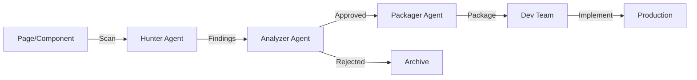

# 🤖 Quimimar Improvement Agent System

## Overview
An intelligent multi-agent system that continuously analyzes the Quimimar web application to identify, evaluate, and package improvement opportunities. The system uses three specialized agents working in coordination to deliver actionable insights.

## 🎭 Agent Team

### 1. **🔍 Improvement Hunter Agent**
- **Purpose**: Scans pages to find improvement opportunities
- **Skills**: UI/UX analysis, performance auditing, modern design trends
- **Output**: Raw improvement suggestions with impact scores

### 2. **🎯 Improvement Analyzer Agent**  
- **Purpose**: Evaluates and prioritizes improvements
- **Skills**: ROI analysis, technical feasibility, business alignment
- **Output**: Approved improvements with priority scores

### 3. **📦 Improvement Packager Agent**
- **Purpose**: Creates detailed implementation guides
- **Skills**: Technical writing, architecture design, test planning
- **Output**: Developer-ready implementation packages

### 4. **🎪 Team Coordinator**
- **Purpose**: Orchestrates the workflow between agents
- **Skills**: Workflow management, reporting, scheduling
- **Output**: Coordinated improvement pipeline

## 📂 Folder Structure

```
agents/
├── system-prompts/           # Agent behavior definitions
│   ├── IMPROVEMENT-HUNTER-AGENT.md
│   ├── IMPROVEMENT-ANALYZER-AGENT.md
│   ├── IMPROVEMENT-PACKAGER-AGENT.md
│   └── IMPROVEMENT-TEAM-COORDINATOR.md
├── improvement-reports/      # Analysis outputs
│   ├── daily/               # Daily scan results
│   ├── weekly/              # Weekly summaries
│   └── packages/            # Implementation packages
├── example-improvement-workflow.ts  # Demo implementation
└── README.md                # This file
```

## 🔄 Workflow



## 💡 How It Works

### 1. **Discovery Phase** (Hunter)
The Hunter agent scans pages looking for:
- Outdated design patterns
- Performance bottlenecks
- Missing modern features
- Accessibility issues
- UX friction points

### 2. **Evaluation Phase** (Analyzer)
The Analyzer agent evaluates each finding:
- Calculates ROI
- Assesses technical feasibility
- Checks business alignment
- Prioritizes by impact
- Approves or rejects

### 3. **Documentation Phase** (Packager)
The Packager agent creates for approved items:
- Technical specifications
- Design requirements
- Implementation steps
- Testing strategies
- Success metrics

## 📊 Example Output

### Hunter Finding
```json
{
  "id": "IMP-001",
  "element": "Hero Section",
  "issue": "Static images lack engagement",
  "suggestion": "Add 3D product showcase",
  "impact": 9,
  "effort": 24
}
```

### Analyzer Decision
```json
{
  "improvement_id": "IMP-001",
  "verdict": "approved",
  "priority_score": 78,
  "roi_months": 1.5,
  "success_metrics": ["Engagement +40%", "Bounce -20%"]
}
```

### Package Summary
```markdown
# 3D Product Showcase Implementation

**Impact**: 9/10 | **Effort**: 24h | **ROI**: 150%

## Implementation Phases:
1. Three.js Setup (8h)
2. Product Model Integration (8h)
3. Interaction & Polish (8h)

[Full package with code examples...]
```

## 🚀 Getting Started

### Run Analysis
```typescript
import { ImprovementTeamCoordinator } from './agents/example-improvement-workflow';

const coordinator = new ImprovementTeamCoordinator();
await coordinator.runImprovementAnalysis(['/']);
```

### Check Reports
```bash
# View latest analysis
cat agents/improvement-reports/2025-01-13-homepage-analysis.md

# List all packages
ls agents/improvement-reports/packages/
```

## 📈 Success Metrics

- **Discovery Rate**: 20+ improvements/week
- **Approval Rate**: 60-70% of findings
- **Implementation Rate**: 50% of approved items
- **Impact Achievement**: 80% of projected metrics

## 🔧 Configuration

### Scanning Schedule
- **Quick Scan**: Daily on high-traffic pages
- **Deep Scan**: Weekly on all pages
- **Competitor Analysis**: Monthly
- **Trend Research**: Quarterly

### Priority Thresholds
- **Critical**: Security/Legal issues (immediate)
- **High**: ROI < 3 months (within 48h)
- **Medium**: ROI < 6 months (weekly)
- **Low**: Nice-to-have (monthly batch)

## 🤝 Integration

### With Development
- Creates JIRA tickets
- Provides code examples
- Includes test cases
- Defines acceptance criteria

### With Design
- References modern examples
- Includes interaction specs
- Provides responsive guidelines
- Links inspiration sources

### With Product
- Aligns with roadmap
- Calculates business impact
- Tracks success metrics
- Reports on outcomes

## 📚 Best Practices

1. **Regular Reviews**: Check reports weekly
2. **Quick Wins First**: Implement high-impact, low-effort items
3. **Measure Impact**: Track actual vs projected metrics
4. **Iterate**: Refine agent prompts based on results
5. **Share Learnings**: Document successful improvements

## 🔮 Future Enhancements

- [ ] Automated JIRA integration
- [ ] Real-time monitoring dashboard
- [ ] A/B test recommendations
- [ ] Competitor tracking automation
- [ ] ML-powered impact predictions
- [ ] Design system compliance checking

---

*The Improvement Agent System is designed to ensure Quimimar stays ahead of the competition with continuous, intelligent enhancement recommendations.*